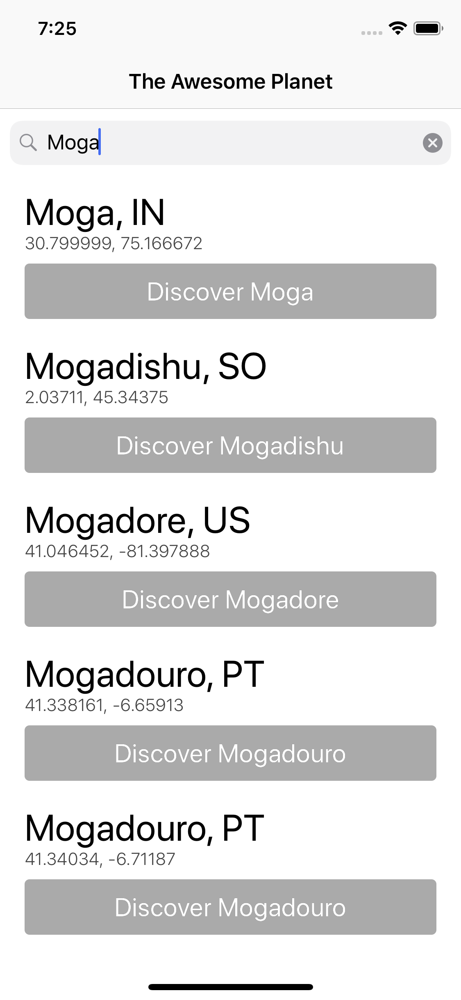
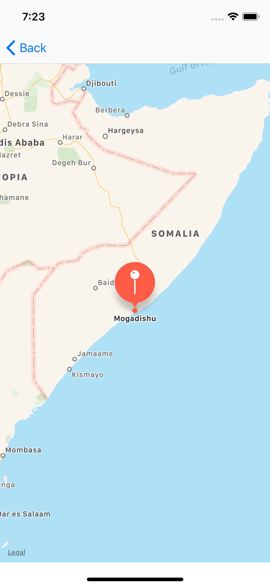
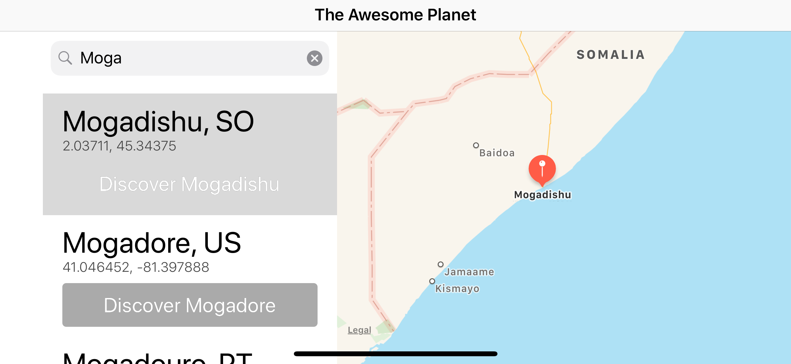
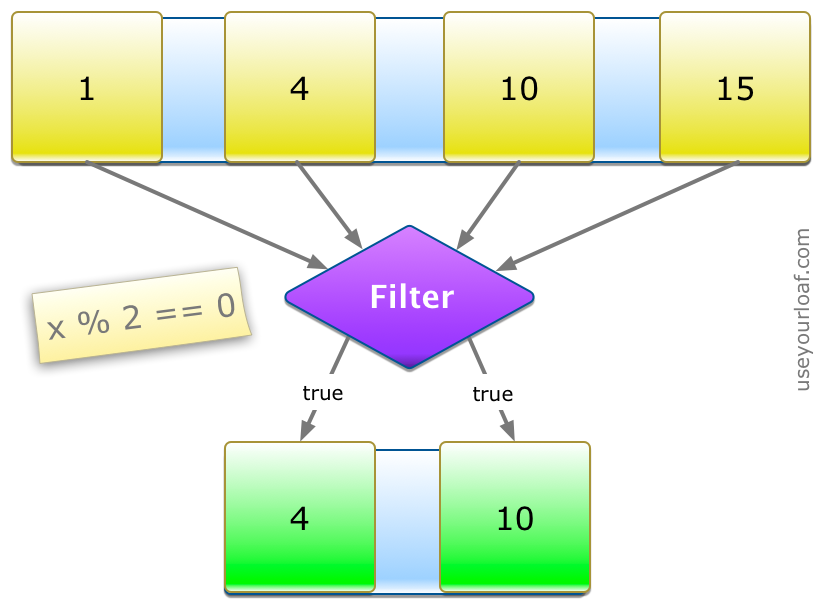

# The Awesome Planet

[](https://travis-ci.com/ysadiq/TheAwesomePlanet)
[](https://codecov.io/gh/ysadiq/TheAwesomePlanet)

This is an iOS app which shows a list of cities, containing around 200K entries in JSON format. Each entry contain the following information.

```
{
    "country": "SO",
    "name": "Mogadishu",
    "_id": 53654,
    "coord": {"lon":45.34375,"lat":2.03711}
}
```
Cities List             |  Map of Mogadishu, Somalia
:-------------------------:|:-------------------------:
  |  

landscape             |
:-------------------------:|


### Features
*  Filters cities by a given prefix string, following these requirements:
    * Follows the prefix definition specified in the **How Search Works** section below.
    * Optimises for fast searches.
    * Search is case insensitive.
* Shows a selected city map with a animated pin as follows:
    * In portrait view: The map is shown in a new screen
    * In landscape mode: The map is shown in the same screen

### How Search Works
A prefix string is defined as: a substring that matches the initial characters of the target string. For instance, assume the following entries:     
* Alabama, US     
* Albuquerque, US     
* Anaheim, US     
* Arizona, US     
* Sydney, AU     

If the given prefix is "A",
all cities but Sydney should appear. Contrariwise, if the given prefix is "s", the only result should be "Sydney, AU".     
If the given prefix is "Al", "Alabama, US" and "Albuquerque, US" are the only results.      
If the prefix given is "Alb" then the only result is "Albuquerque, US"

### How Search Implemented
The app uses higher order functions `filter` to loop over the list of cities and return an Array containing only those cities that match an include condition.



The `filter` method has a single argument that specifies the include condition. This is a closure that takes as an argument the element from the collection and must return a `Bool` indicating if the item should be included in the result.

An example that filters as array of integers returning only the even values:

```
let digits = [1,4,10,15]
let even = digits.filter { $0 % 2 == 0 }
// [4, 10]
```
### Prerequisites

Should use at least Xcode 10 and iOS 10.0.

## Contributing

Please read [CONTRIBUTING.md](https://gist.github.com/PurpleBooth/b24679402957c63ec426) for details on our code of conduct, and the process for submitting pull requests to us.

## License

This project is licensed under the MIT License - see the [LICENSE.md](LICENSE.md) file for details
